# 📈 Crypto Real-Time Streaming Pipeline

> Pipeline de streaming temps réel de prix de cryptomonnaies avec détection d'anomalies ML et dashboard interactif.

## 🌐 Source de Données

Les prix sont récupérés via l'endpoint **CoinGecko `/simple/price`** (gratuit, sans clé API).  
Chaque appel retourne le prix USD, la variation 24h et le volume 24h pour les 5 coins suivants : `bitcoin`, `ethereum`, `binancecoin`, `solana`, `cardano`.  
La fréquence de collecte est de **15 secondes** pour respecter le rate limit de l'API gratuite (~30 appels/minute).

---
## 🏗️ Architecture

```
CoinGecko API (toutes les 15s)
        │
        ▼
┌─────────────────┐
│  kafka/         │   producer.py → topic: crypto_prices
│  producer.py    │
└────────┬────────┘
         │ Kafka (port 39092)
         ▼
┌─────────────────────────────────────────┐
│  spark/                                 │
│  ├── streaming_app.py  (point d'entrée) │
│  ├── processing.py     (foreachBatch)   │
│  ├── ml_helpers.py     (ML + helpers)   │
│  └── storage.py        (SQLite)         │
└────────┬────────────────────────────────┘
         │
         ▼
┌─────────────────┐     ┌──────────────────┐
│  output/        │     │  SQLite          │
│  *.csv (backup) │────▶│  crypto.db       │
└─────────────────┘     └────────┬─────────┘
                                  │
                                  ▼
                        ┌─────────────────┐
                        │  dashboard/     │
                        │  app.py         │
                        │  (Streamlit)    │
                        └─────────────────┘
```

---

## 📦 Stack Technique

| Composant     | Technologie         | Rôle                          |
| ------------- | ------------------- | ----------------------------- |
| Ingestion     | Apache Kafka 7.5.0  | Message broker temps réel     |
| Orchestration | Docker Compose      | Kafka + Zookeeper             |
| Traitement    | Apache Spark 3.3.2  | Structured Streaming          |
| ML            | scikit-learn        | Régression linéaire + Z-Score |
| Stockage      | SQLite + CSV        | Persistance des données       |
| Visualisation | Streamlit + Plotly  | Dashboard interactif          |
| API Source    | CoinGecko (gratuit) | Prix crypto en temps réel     |

---

## 📁 Structure du Projet

```
crypto-streaming/
│
├── docker-compose.yml          # Kafka + Zookeeper
├── requirements.txt            # Dépendances Python
├── .gitignore
│
├── kafka/
│   └── producer.py             # Fetch CoinGecko → Kafka
│
├── spark/
│   ├── streaming_app.py        # Point d'entrée Spark
│   ├── processing.py           # Logique foreachBatch
│   ├── ml_helpers.py           # ML : régression + Z-Score
│   └── storage.py              # Sauvegarde SQLite
│
├── dashboard/
│   └── app.py                  # Dashboard Streamlit
│
├── output/                     # CSV + SQLite
└── checkpoints/                # (gitignored) Spark checkpoints
```

---

## 🔧 Modules Spark Détaillés

### `streaming_app.py` — Point d'entrée

- Initialise la **SparkSession** avec le connecteur Kafka
- Définit le **schéma JSON** des messages (`coin`, `timestamp`, `price_usd`, `change_24h`, `volume_24h`)
- Lit le stream depuis Kafka topic `crypto_prices`
- Lance le stream avec `foreachBatch` → `process_batch`

### `processing.py` — Traitement par batch

Contient la fonction `process_batch(batch_df, batch_id)` qui exécute à chaque micro-batch :

| Étape                | Description                                                                            |
| -------------------- | -------------------------------------------------------------------------------------- |
| **1. Data Cleaning** | Suppression nulls, filtrage prix≤0, volume≤0, variation hors [-100,100], déduplication |
| **2. Agrégations**   | avg/max/min price, price_range, avg change/volume par coin                             |
| **3. Windowing**     | Fenêtre glissante 1 minute / slide 30 secondes                                         |
| **4a. Régression**   | Prédiction du prochain prix par coin                                                   |
| **4b. Z-Score**      | Détection d'anomalies par coin                                                         |
| **5. Sauvegarde**    | CSV + SQLite                                                                           |

### `ml_helpers.py` — Modèles ML

**Régression Linéaire (`predict_next_price`)**

- Entraîne un modèle `LinearRegression` sur les 50 derniers prix de chaque coin
- Prédit le prochain prix et détermine la tendance (HAUSSE/BAISSE)
- Nécessite un minimum de **15 points** historiques

**Z-Score (`detect_anomaly_zscore`)**

- Calcule le Z-Score : `z = (prix_actuel - moyenne) / écart_type`
- Seuil d'anomalie : **|z| > 3.0**
- Prix arrondi à 4 décimales pour éviter les faux positifs
- Détecte les mouvements de prix statistiquement anormaux

### `storage.py` — Persistance SQLite

Sauvegarde dans `output/crypto.db` avec 4 tables :

| Table                | Contenu                                            |
| -------------------- | -------------------------------------------------- |
| `crypto_clean`       | Données nettoyées avec anomaly_score et is_anomaly |
| `crypto_agg`         | Agrégations par coin et par batch                  |
| `crypto_predictions` | Prédictions de prix par coin                       |
| `crypto_anomalies`   | Anomalies détectées avec z_score et batch_id       |

---

## 📊 Dashboard — Description des Visualisations

### 1. 🏷️ KPIs (Métriques en temps réel)
- **Contenu** : Prix actuel et variation 24h pour chaque coin
- **Objectif** : Vue d'ensemble instantanée de l'état du marché
- **Mise à jour** : À chaque refresh (toutes les 10 secondes)

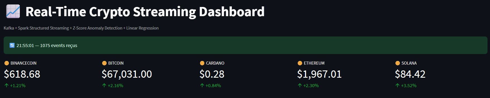

---

### 2. 🕯️ Candlestick Chart (OHLC 1 minute)
- **Contenu** : Open, High, Low, Close par minute pour le coin sélectionné
- **Objectif** : Visualisation professionnelle de l'évolution des prix, comme un terminal financier réel
- **Interaction** : Sélecteur de coin avec boutons radio colorés (🟠 Bitcoin, 🔵 Ethereum, 🟡 BNB, 🟣 Solana, 🔷 Cardano)
- **Couleurs** : Couleur propre à chaque coin pour la hausse, rouge (#EF5350) pour la baisse

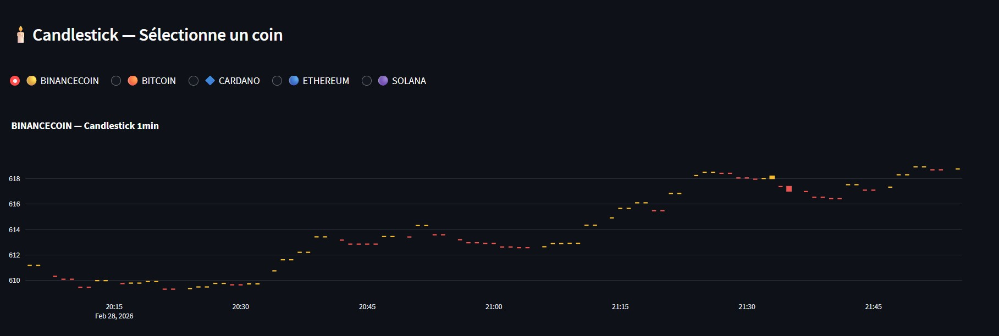

---

### 3. 💰 Prix en Temps Réel (Facet Line Chart)
- **Contenu** : Évolution du prix par minute, un sous-graphe par coin
- **Objectif** : Comparer les tendances de chaque coin avec une échelle Y indépendante par coin (évite l'écrasement visuel dû aux différences d'échelle entre BTC ~65k et ADA ~0.27)
- **Technique** : `facet_row` Plotly avec `matches=None` pour des axes Y indépendants

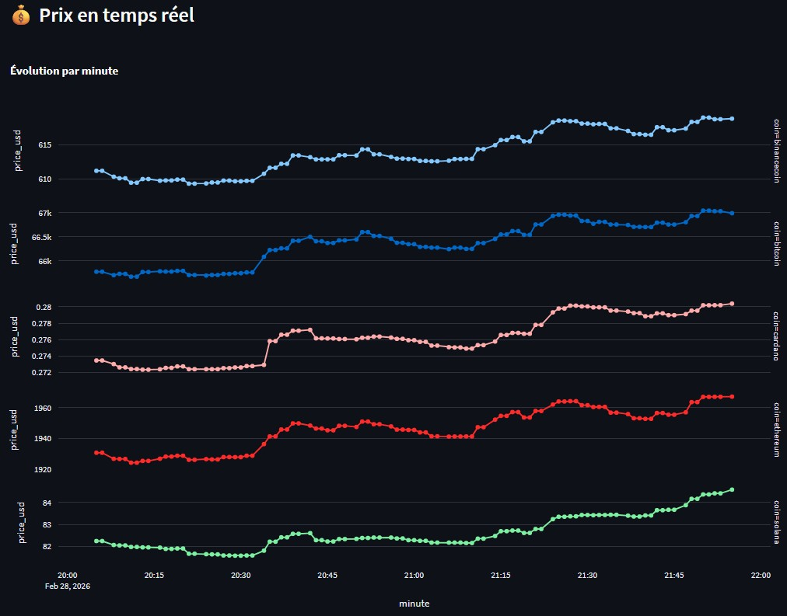

---

### 4. 📊 Variation 24h (Bar Chart)
- **Contenu** : Pourcentage de variation sur 24h pour chaque coin
- **Objectif** : Identifier rapidement les coins en hausse (vert) et en baisse (rouge)
- **Couleurs** : Échelle `RdYlGn` (rouge → jaune → vert)

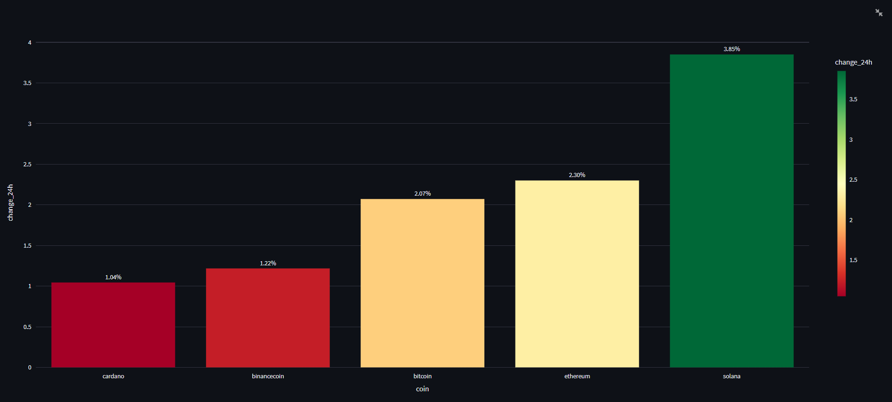

---

### 5. 🫧 Volume Relatif (Bubble Chart)
- **Contenu** : Axe X = coin, Axe Y = variation 24h, taille de la bulle = volume 24h
- **Objectif** : Visualiser simultanément la performance et l'activité de trading de chaque coin
- **Lecture** : Une grande bulle verte = coin en hausse avec fort volume (signal fort)

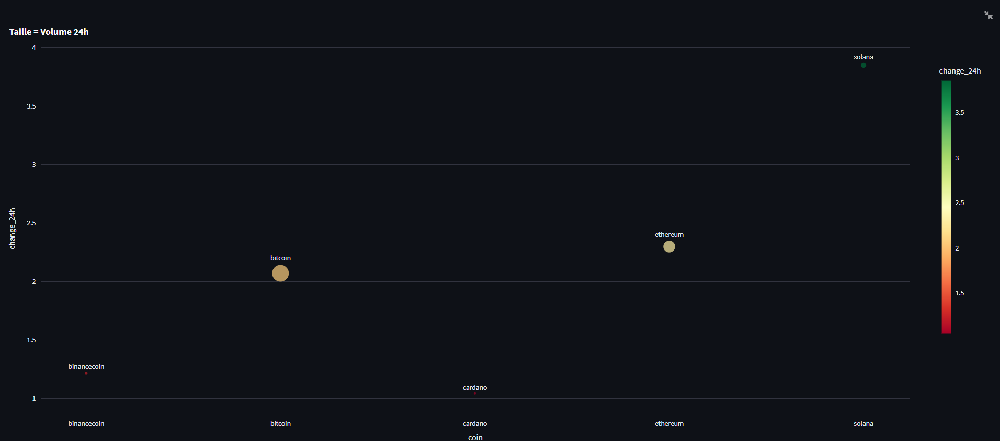

---

### 6. 🔬 Z-Score Anomaly Detection (Scatter Plot)
- **Contenu** : Z-Score de chaque coin dans le temps, avec symbole différent pour les anomalies
- **Objectif** : Suivre l'évolution du score d'anomalie et identifier les pics statistiquement anormaux
- **Seuil** : Ligne rouge à |z| = 3.0 (anomalie détectée si dépassé)
- **Symboles** : Cercle = normal, Croix = anomalie détectée

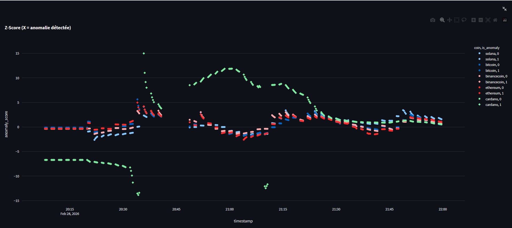

---

### 7. 📦 Volume 24h (Bar Chart Log)
- **Contenu** : Volume de trading sur 24h par coin en échelle logarithmique
- **Objectif** : Comparer les volumes malgré les différences d'ordre de grandeur (BTC ~40B vs ADA ~600M)

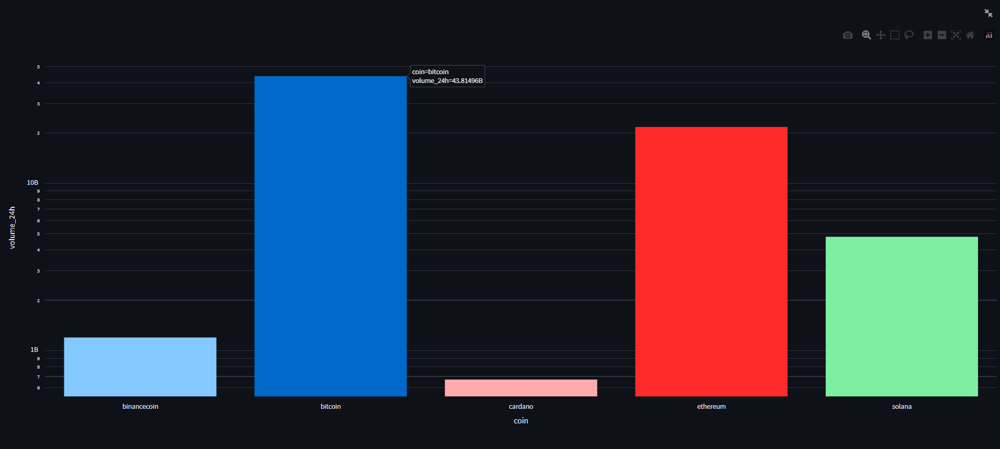

---

### 8. 🔮 Prédictions ML (Métriques)
- **Contenu** : Prix prédit pour le prochain batch + différence avec le prix actuel
- **Objectif** : Résultat de la régression linéaire entraînée sur les 50 derniers prix
- **Icônes** : 📈 HAUSSE / 📉 BAISSE selon la pente du modèle

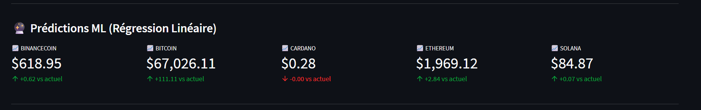

---

### 9. 🚨 Alertes Anomalies (Table)
- **Contenu** : Historique des anomalies détectées avec coin, z_score, mean_price, std_price
- **Objectif** : Traçabilité complète des événements anormaux détectés par le Z-Score

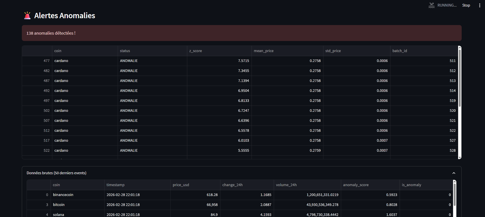

---

## 🚀 Installation & Lancement

### Prérequis

- Python 3.10+
- Docker Desktop
- Java 11+ (pour Spark)
- Hadoop (Windows uniquement) : `C:\hadoop`

### Installation

```bash
git clone https://github.com/fatmachahed/crypto-streaming.git
cd crypto-streaming
python -m venv venv
venv\Scripts\activate
pip install -r requirements.txt
```

### Lancement (4 terminaux)

```bash
# Terminal 1 — Infrastructure Kafka
docker-compose up -d

# Terminal 2 — Spark Streaming (lancer en premier)
python spark/streaming_app.py

# Terminal 3 — Producer CoinGecko
python kafka/producer.py

# Terminal 4 — Dashboard
streamlit run dashboard/app.py
```

### Vérification

```bash
# Vérifier que Kafka tourne
docker ps
# Doit afficher cp-kafka:7.5.0 sur le port 39092

# Vérifier que les données arrivent
ls output/
# Doit afficher crypto.db, crypto_clean.csv, etc.
```

---

## 📋 Requirements

```
pyspark==3.3.2
confluent-kafka
requests
pandas
numpy
scikit-learn
streamlit
plotly
```

---

## 🖥️ Dashboard Complet

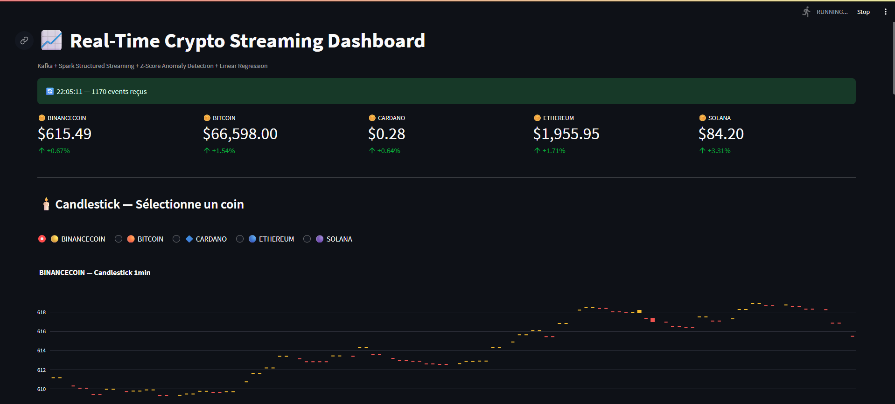

---

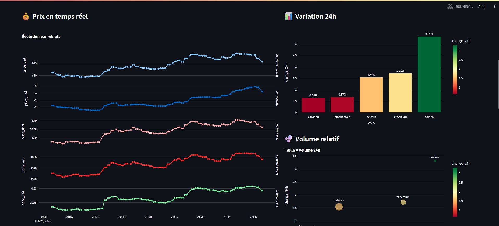

---

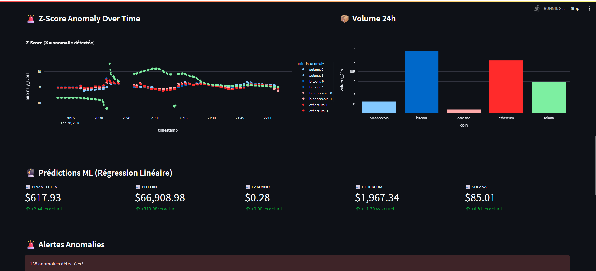

---

## 👥 Équipe

- **Fatma Chahed**
- **Aziz Dhif**
- **Mohamed Kerim ElKadhi**
